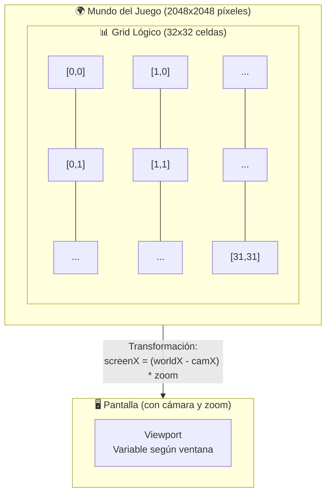
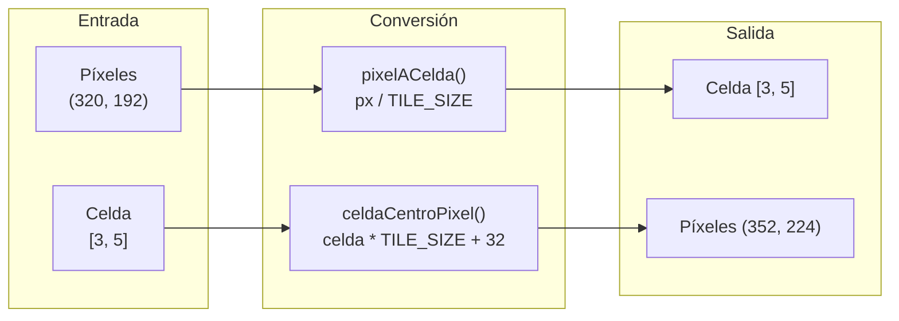
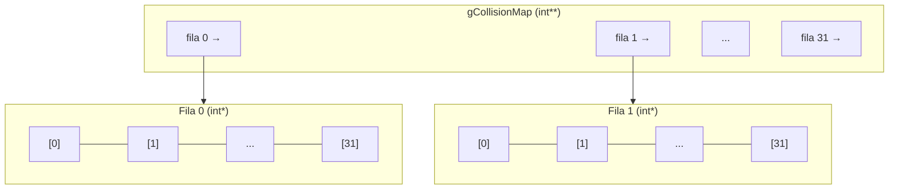
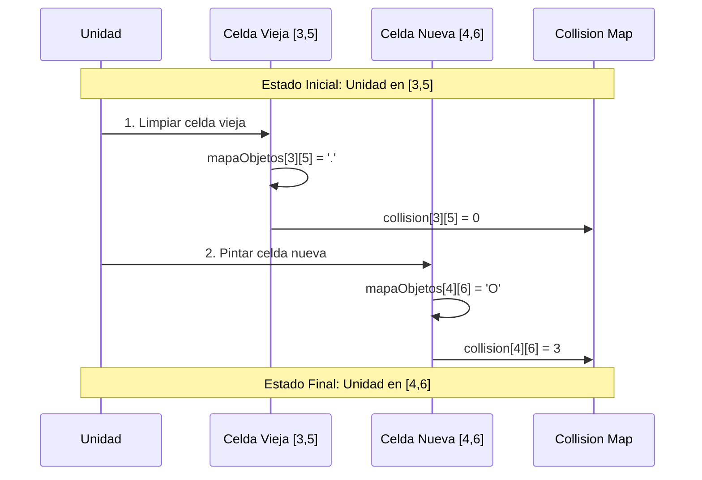
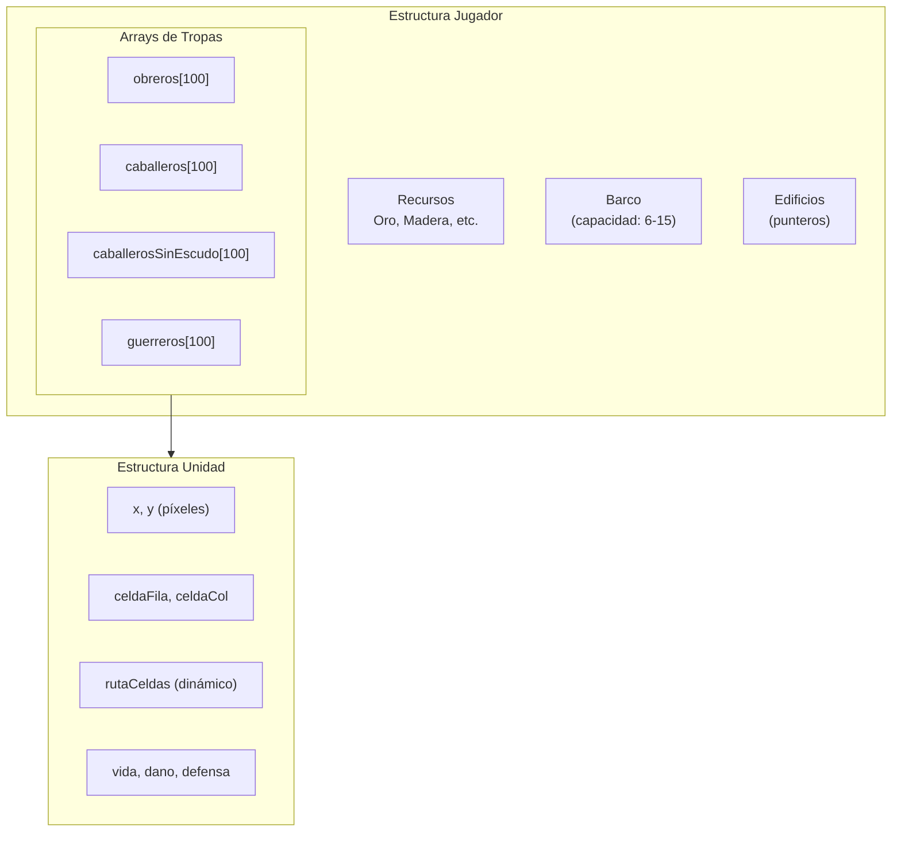
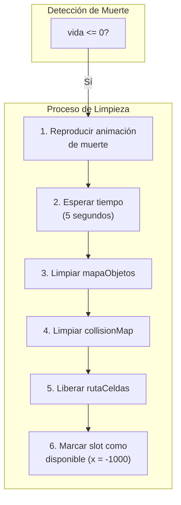
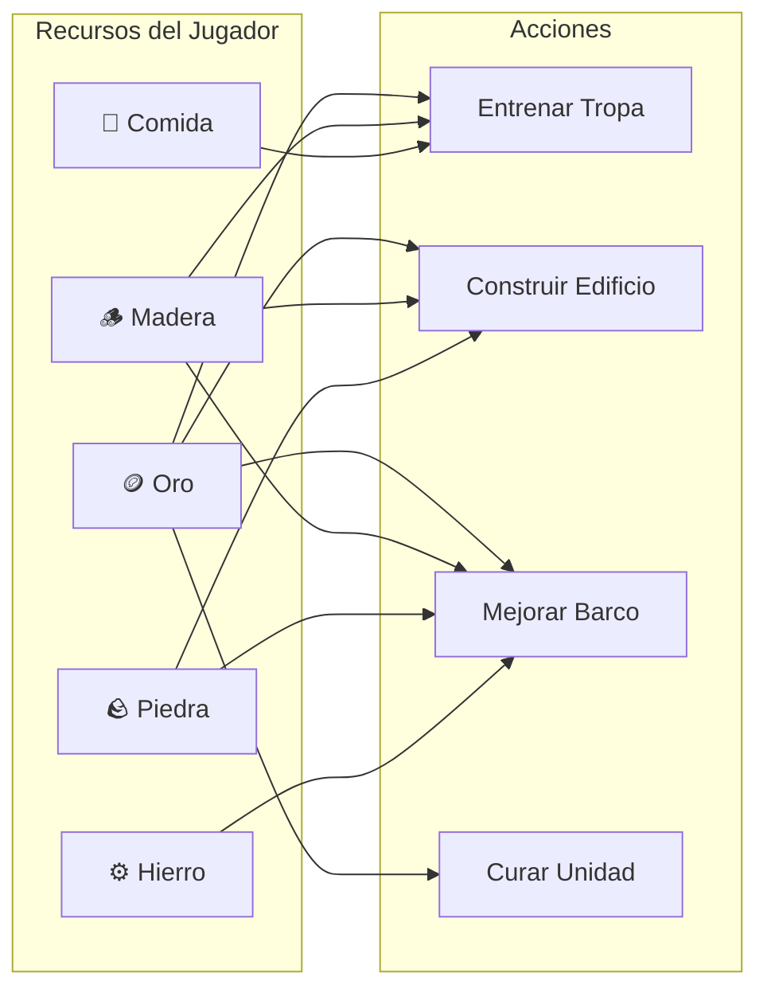

# MANUAL DE MAPA Y RECURSOS
## Guía de Aprendizaje Profunda para Gestión del Mapa y Ciclo de Vida de Tropas

**Versión:** 1.0  
**Dirigido a:** Estudiantes de Ingeniería de Sistemas  
**Lenguaje:** C con API de Windows

---

## Tabla de Contenidos

1. [El Sistema de Coordenadas](#1-el-sistema-de-coordenadas-lógica-vs-pantalla)
2. [Colocación y Cambio de Posición de Objetos](#2-colocación-y-cambio-de-posición-de-objetos)
3. [Gestión de Tropas y Unidades](#3-gestión-de-tropas-y-unidades)
4. [Eliminación de Objetos y Limpieza de Memoria](#4-eliminación-de-objetos-y-limpieza-de-memoria)
5. [Vínculo con el Sistema de Recursos](#5-vínculo-con-el-sistema-de-recursos)
6. [Desafíos de Ingeniería](#6-desafíos-de-ingeniería)

---

## 1. El Sistema de Coordenadas (Lógica vs. Pantalla)

### 1.1 Arquitectura del Mundo del Juego

El juego "Islas en Guerra" utiliza un sistema de coordenadas dual que separa la **lógica del juego** de la **representación visual**. Esta separación es fundamental para el diseño de juegos eficientes.

#### Constantes Fundamentales

```c
// Definidas en mapa.h
#define MAPA_SIZE   2048                    // Mundo: 2048x2048 píxeles
#define TILE_SIZE   64                      // Cada celda: 64x64 píxeles
#define GRID_SIZE   (MAPA_SIZE / TILE_SIZE) // Grid: 32x32 celdas
```

**Diagrama del Sistema de Coordenadas:**



### 1.2 Traducción de Coordenadas: Matriz → Píxeles

La conversión entre coordenadas lógicas (matriz) y físicas (píxeles) es bidireccional:

#### De Píxeles a Celda (para lógica de juego)

```c
// Función auxiliar: Convierte posición en píxeles a índice de celda
static int pixelACelda(float px) {
    int c = (int)(px / (float)TILE_SIZE);
    // Clamp: asegurar que el resultado esté dentro del grid
    if (c < 0) return 0;
    if (c > GRID_SIZE - 1) return GRID_SIZE - 1;
    return c;
}

// Ejemplo de uso:
float posicionX = 320.0f;  // Posición del obrero en píxeles
int columna = pixelACelda(posicionX);  // columna = 5 (320/64 = 5)
```

#### De Celda a Píxeles (para renderizado)

```c
// Obtiene el centro de una celda en píxeles
static float celdaCentroPixel(int celda) {
    return (float)(celda * TILE_SIZE) + (float)(TILE_SIZE / 2);
}

// Ejemplo de uso:
int columna = 5;
float centroX = celdaCentroPixel(columna);  // centroX = 352.0f (5*64 + 32)
```

**Diagrama de Conversión:**



### 1.3 Acceso Optimizado con Aritmética de Punteros

El juego utiliza **aritmética de punteros** para acceder eficientemente a las celdas del mapa. Esto es más rápido que la indexación tradicional de arrays.

#### Estructura de la Matriz Lógica

```c
// Matriz global de objetos (declarada en mapa.c)
char mapaObjetos[GRID_SIZE][GRID_SIZE];  // 32x32 caracteres

// Simbología de objetos (mapa.h)
#define SIMBOLO_AGUA      '~'   // Agua (no transitable)
#define SIMBOLO_VACIO     '.'   // Terreno vacío
#define SIMBOLO_ARBOL     'A'   // Árbol (obstáculo)
#define SIMBOLO_OBRERO    'O'   // Obrero
#define SIMBOLO_CABALLERO 'C'   // Caballero
#define SIMBOLO_GUERRERO  'G'   // Guerrero
#define SIMBOLO_VACA      'V'   // Vaca (recurso móvil)
#define SIMBOLO_BARCO     'B'   // Barco
#define SIMBOLO_EDIFICIO  'E'   // Edificio (ayuntamiento)
#define SIMBOLO_MINA      'M'   // Mina
#define SIMBOLO_CUARTEL   'Q'   // Cuartel (barracks)
#define SIMBOLO_RECURSO   '$'   // Recurso (para futuro uso)
#define SIMBOLO_ENEMIGO   'X'   // Enemigo pasivo en isla
#define SIMBOLO_JUGADOR   'P'   // Posición base del jugador
```

#### Acceso con Aritmética de Punteros

```c
// Método tradicional (más lento):
char contenido = mapaObjetos[fila][columna];

// Método optimizado con punteros (usado en el proyecto):
char *fila_ptr = *(mapaObjetos + fila);      // Obtener puntero a la fila
char contenido = *(fila_ptr + columna);       // Obtener contenido de la celda

// Función de acceso encapsulada (mapa.c):
char obtenerContenidoCelda(char *celda) {
    return *celda;  // Desreferenciación directa
}
```

#### Mapa de Colisiones con Memoria Dinámica

```c
// Matriz dinámica de colisiones (int**)
// Valores: 0=libre, 1=obstáculo, 2=edificio, 3=unidad
static int **gCollisionMap = NULL;

// Asignación de memoria
static void collisionMapAllocIfNeeded(void) {
    if (gCollisionMap) return;  // Ya existe
    
    // Asignar array de punteros a filas
    gCollisionMap = (int **)malloc(GRID_SIZE * sizeof(int *));
    if (!gCollisionMap) return;
    
    // Asignar cada fila individualmente
    for (int i = 0; i < GRID_SIZE; i++) {
        *(gCollisionMap + i) = (int *)calloc(GRID_SIZE, sizeof(int));
        if (!*(gCollisionMap + i)) {
            // Error: liberar memoria ya asignada
            for (int k = 0; k < i; k++)
                free(*(gCollisionMap + k));
            free(gCollisionMap);
            gCollisionMap = NULL;
            return;
        }
    }
}

// Acceso a una celda de colisión
int **col = mapaObtenerCollisionMap();
int *fila_ptr = *(col + fila);     // Puntero a la fila
int valor = *(fila_ptr + columna); // Valor de colisión
```

**Diagrama de Memoria:**



---

## 2. Colocación y Cambio de Posición de Objetos

### 2.1 El Arte de Posicionar: Insertar Objetos en el Mapa

Para insertar cualquier objeto en el mapa, debemos actualizar dos estructuras:
1. **`mapaObjetos`**: Matriz lógica de caracteres
2. **`gCollisionMap`**: Matriz de colisiones

#### Función de Registro de Objetos

```c
// Registra un objeto en mapaObjetos (conversión píxeles -> celda)
void mapaRegistrarObjeto(float pixelX, float pixelY, char simbolo) {
    // Convertir píxeles a índices de celda
    int fila = (int)(pixelY / TILE_SIZE);
    int col = (int)(pixelX / TILE_SIZE);
    
    // Validar límites del mapa
    if (fila < 0 || fila >= GRID_SIZE || col < 0 || col >= GRID_SIZE) {
        return;  // Fuera de límites
    }
    
    // Registrar usando aritmética de punteros
    char *ptrCelda = *(mapaObjetos + fila) + col;
    *ptrCelda = simbolo;
}

// Ejemplo de uso: Colocar un castillo en (512, 512) píxeles
mapaRegistrarObjeto(512.0f, 512.0f, SIMBOLO_EDIFICIO);
```

#### Marcar Edificios en el Collision Map

```c
// Marca un edificio como área bloqueada (múltiples celdas)
void mapaMarcarEdificio(float x, float y, int ancho, int alto) {
    collisionMapAllocIfNeeded();
    
    // Calcular celdas que ocupa el edificio
    int celInicioFila = (int)(y / TILE_SIZE);
    int celInicioCol = (int)(x / TILE_SIZE);
    int celFinFila = (int)((y + alto) / TILE_SIZE);
    int celFinCol = (int)((x + ancho) / TILE_SIZE);
    
    // Marcar celdas como bloqueadas + eliminar árboles cercanos
    // (Expandir 2 celdas de margen para las copas de árboles)
    for (int f = celInicioFila - 2; f <= celFinFila + 2 && f < GRID_SIZE; f++) {
        for (int c = celInicioCol - 2; c <= celFinCol + 2 && c < GRID_SIZE; c++) {
            if (f >= 0 && c >= 0) {
                // Bloquear solo las celdas del edificio exacto
                if (f >= celInicioFila && f <= celFinFila && 
                    c >= celInicioCol && c <= celFinCol) {
                    gCollisionMap[f][c] = 1;  // Bloquear celda
                }
                // Eliminar árboles en área expandida
                mapaObjetos[f][c] = 0;
            }
        }
    }
}
```

### 2.2 Proceso "Limpiar y Pintar": Mover Objetos

Mover un objeto requiere dos pasos atómicos:
1. **Limpiar**: Eliminar referencia de la posición vieja
2. **Pintar**: Escribir en la nueva posición

**Diagrama del Proceso:**



#### Implementación de Movimiento

```c
// Mueve un objeto en mapaObjetos (limpia celda vieja, marca celda nueva)
void mapaMoverObjeto(float viejoX, float viejoY, 
                     float nuevoX, float nuevoY, char simbolo) {
    // Calcular celdas
    int viejaFila = (int)(viejoY / TILE_SIZE);
    int viejaCol = (int)(viejoX / TILE_SIZE);
    int nuevaFila = (int)(nuevoY / TILE_SIZE);
    int nuevaCol = (int)(nuevoX / TILE_SIZE);
    
    // Validar límites
    if (viejaFila >= 0 && viejaFila < GRID_SIZE &&
        viejaCol >= 0 && viejaCol < GRID_SIZE) {
        // LIMPIAR: Eliminar de posición vieja usando punteros
        char *ptrVieja = *(mapaObjetos + viejaFila) + viejaCol;
        *ptrVieja = SIMBOLO_VACIO;
    }
    
    if (nuevaFila >= 0 && nuevaFila < GRID_SIZE &&
        nuevaCol >= 0 && nuevaCol < GRID_SIZE) {
        // PINTAR: Escribir en posición nueva usando punteros
        char *ptrNueva = *(mapaObjetos + nuevaFila) + nuevaCol;
        *ptrNueva = simbolo;
    }
}
```

#### Actualización de Ocupación con Collision Map

```c
// Marcar/desmarcar una celda en el collision map
static void marcarHuellaObrero(int **collision, int fila, int col, int valor) {
    if (!collision || fila < 0 || col < 0 || 
        fila >= GRID_SIZE || col >= GRID_SIZE) return;
    
    // Marcar usando aritmética de punteros
    int *fila_ptr = *(collision + fila);
    *(fila_ptr + col) = valor;
}

// Actualizar ocupación cuando una unidad cambia de celda
static void ocupacionActualizarUnidad(int **collision, Unidad *o, 
                                       int nuevaF, int nuevaC) {
    if (!collision) return;
    
    // Liberar celda anterior
    if (o->celdaFila >= 0 && o->celdaCol >= 0) {
        marcarHuellaObrero(collision, o->celdaFila, o->celdaCol, 0);
    }
    
    // Marcar nueva celda
    o->celdaFila = nuevaF;
    o->celdaCol = nuevaC;
    marcarHuellaObrero(collision, nuevaF, nuevaC, 3);  // 3 = ocupado por unidad
}
```

---

## 3. Gestión de Tropas y Unidades

### 3.1 Estructura de Almacenamiento de Tropas

El juego utiliza **arrays fijos** para almacenar las tropas, organizados por tipo de unidad dentro de la estructura del jugador.

#### Definición de Límites

```c
// Constantes de límites (recursos.h)
#define MAX_OBREROS             100
#define MAX_CABALLEROS          100
#define MAX_CABALLEROS_SIN_ESCUDO 100
#define MAX_GUERREROS           100
```

#### Estructura del Jugador

```c
// Estructura completa del jugador (recursos.h)
struct Jugador {
    char Nombre[30];
    
    // === RECURSOS ===
    int Comida;
    int Oro;
    int Madera;
    int Piedra;
    int Hierro;
    
    // === TROPAS (Arrays Fijos) ===
    Unidad obreros[MAX_OBREROS];                     // 100 obreros máx
    Unidad caballeros[MAX_CABALLEROS];               // 100 caballeros máx
    Unidad caballerosSinEscudo[MAX_CABALLEROS_SIN_ESCUDO];
    Unidad guerreros[MAX_GUERREROS];                 // 100 guerreros máx
    
    // === VEHÍCULOS ===
    Barco barco;  // Un solo barco (capacidad según mejora: 6-15 tropas)
    
    // === EDIFICIOS ===
    void *ayuntamiento;  // Puntero a Edificio
    void *mina;
    void *cuartel;
    
    // === ESTADO ===
    EstadoVista vistaActual;
    int islaActual;
    bool islasConquistadas[6];
};
```

#### Estructura de Unidad

```c
// Estructura de unidad individual (recursos.h)
typedef struct {
    // Posición en el mundo (píxeles)
    float x, y;
    float destinoX, destinoY;
    bool moviendose;
    bool seleccionado;
    
    // Dirección y animación
    Direccion dir;
    int frame;
    const Animacion *animActual;
    int animTick;
    
    // === Movimiento RTS con pathfinding ===
    int objetivoFila, objetivoCol;
    int *rutaCeldas;    // Ruta dinámica (array de celdas a visitar)
    int rutaLen;
    int rutaIdx;
    
    // === Sincronización Matriz <-> Mundo ===
    int celdaFila, celdaCol;  // Celda actualmente ocupada
    
    // === Tipo y Atributos ===
    TipoUnidad tipo;
    float vida, vidaMax;
    float dano, critico, defensa, alcance;
    
    // === Estado de Combate ===
    bool recibiendoAtaque;
    ULONGLONG tiempoMuerteMs;
    int frameMuerte;
} Unidad;
```

**Diagrama de Organización:**



### 3.2 Creación de Batallones: Spawnear Múltiples Tropas

#### Función Genérica de Entrenamiento

```c
// Función genérica para entrenar cualquier tipo de unidad
static bool entrenarUnidadGenerico(struct Jugador *j, Unidad *array, 
                                    int count, Edificio *cuartel, 
                                    TipoUnidad tipo) {
    if (!cuartel) return false;
    
    // Buscar slot libre en el array
    for (int i = 0; i < count; i++) {
        if (array[i].x >= 0) continue;  // Slot ocupado
        
        // === CALCULAR POSICIÓN DE SPAWN ===
        float offsetX = (float)((i % 3) * 70);
        float offsetY = (float)((i / 3) * 70);
        float baseX = cuartel->x + offsetX;
        float baseY = cuartel->y + cuartel->alto + 20 + offsetY;
        
        array[i].x = baseX;
        array[i].y = baseY;
        
        // === VALIDAR Y AJUSTAR POSICIÓN ===
        int **col = mapaObtenerCollisionMap();
        if (col) {
            int cX = (int)(array[i].x / (float)TILE_SIZE);
            int cY = (int)(array[i].y / (float)TILE_SIZE);
            
            // Si la celda está ocupada, buscar celda libre cercana
            if (col[cY][cX] != 0 || mapaObjetos[cY][cX] != 0) {
                bool encontrado = false;
                int centroCX = (int)((cuartel->x + 64) / TILE_SIZE);
                int centroCY = (int)((cuartel->y + 64) / TILE_SIZE);
                
                // Búsqueda en espiral
                for (int r = 2; r < 8 && !encontrado; r++) {
                    for (int dy = -r; dy <= r && !encontrado; dy++) {
                        for (int dx = -r; dx <= r; dx++) {
                            int ny = centroCY + dy;
                            int nx = centroCX + dx;
                            
                            if (ny >= 0 && ny < GRID_SIZE && 
                                nx >= 0 && nx < GRID_SIZE &&
                                col[ny][nx] == 0 && 
                                mapaObjetos[ny][nx] == 0) {
                                
                                array[i].x = nx * (float)TILE_SIZE;
                                array[i].y = ny * (float)TILE_SIZE;
                                encontrado = true;
                                break;
                            }
                        }
                    }
                }
            }
            
            // Marcar ocupación
            int finalY = (int)(array[i].y / TILE_SIZE);
            int finalX = (int)(array[i].x / TILE_SIZE);
            col[finalY][finalX] = 3;  // Ocupado por unidad
            
            // Registrar en mapaObjetos
            char simbolo = (tipo == TIPO_OBRERO) ? SIMBOLO_OBRERO :
                           (tipo == TIPO_GUERRERO) ? SIMBOLO_GUERRERO : 
                           SIMBOLO_CABALLERO;
            mapaRegistrarObjeto(array[i].x, array[i].y, simbolo);
        }
        
        // === INICIALIZAR ATRIBUTOS ===
        array[i].destinoX = array[i].x;
        array[i].destinoY = array[i].y;
        array[i].moviendose = false;
        array[i].seleccionado = false;
        array[i].dir = DIR_FRONT;
        array[i].frame = 0;
        array[i].celdaFila = -1;
        array[i].celdaCol = -1;
        array[i].rutaCeldas = NULL;
        array[i].tipo = tipo;
        array[i].animActual = animPorDireccion(DIR_FRONT);
        array[i].recibiendoAtaque = false;
        array[i].tiempoMuerteMs = 0;
        array[i].frameMuerte = 0;
        
        // === ASIGNAR STATS SEGÚN TIPO ===
        switch (tipo) {
            case TIPO_OBRERO:
                array[i].vidaMax = OBRERO_VIDA_MAX;  // 100
                break;
            case TIPO_GUERRERO:
                array[i].vidaMax = GUERRERO_VIDA;    // 120
                array[i].dano = GUERRERO_DANO;       // 50
                array[i].critico = GUERRERO_CRITICO; // 30
                array[i].defensa = GUERRERO_DEFENSA; // 15
                array[i].alcance = 64;
                break;
            default:  // Caballero
                array[i].vidaMax = CABALLERO_VIDA;    // 150
                array[i].dano = CABALLERO_DANO;       // 35
                array[i].defensa = CABALLERO_DEFENSA; // 25
                array[i].critico = CABALLERO_CRITICO; // 15
                array[i].alcance = 64;
        }
        array[i].vida = array[i].vidaMax;
        
        return true;  // Unidad creada exitosamente
    }
    
    return false;  // No hay slots disponibles
}

// Funciones específicas de entrenamiento
bool entrenarObrero(struct Jugador *j, float x, float y) {
    return entrenarUnidadGenerico(j, j->obreros, MAX_OBREROS, 
                                   (Edificio*)j->cuartel, TIPO_OBRERO);
}

bool entrenarCaballero(struct Jugador *j, float x, float y) {
    return entrenarUnidadGenerico(j, j->caballeros, MAX_CABALLEROS, 
                                   (Edificio*)j->cuartel, TIPO_CABALLERO);
}

bool entrenarGuerrero(struct Jugador *j, float x, float y) {
    return entrenarUnidadGenerico(j, j->guerreros, MAX_GUERREROS, 
                                   (Edificio*)j->cuartel, TIPO_GUERRERO);
}
```

### 3.3 Implementación del Límite de Tropas

El límite de tropas se implementa mediante:

1. **Arrays de tamaño fijo**: `Unidad obreros[MAX_OBREROS]`
2. **Marcador de slot vacío**: `x < 0` indica slot disponible
3. **Búsqueda secuencial**: Encontrar primer slot libre

```c
// Contar tropas activas
int contarTropasActivas(struct Jugador *j) {
    int total = 0;
    
    // Contar obreros
    for (int i = 0; i < MAX_OBREROS; i++) {
        if (j->obreros[i].x >= 0 && j->obreros[i].vida > 0) total++;
    }
    
    // Contar caballeros
    for (int i = 0; i < MAX_CABALLEROS; i++) {
        if (j->caballeros[i].x >= 0 && j->caballeros[i].vida > 0) total++;
    }
    
    // Contar guerreros
    for (int i = 0; i < MAX_GUERREROS; i++) {
        if (j->guerreros[i].x >= 0 && j->guerreros[i].vida > 0) total++;
    }
    
    return total;
}

// Verificar si se puede crear más tropas
bool puedeCrearTropa(struct Jugador *j, TipoUnidad tipo) {
    Unidad *array;
    int max;
    
    switch (tipo) {
        case TIPO_OBRERO:
            array = j->obreros;
            max = MAX_OBREROS;
            break;
        case TIPO_CABALLERO:
            array = j->caballeros;
            max = MAX_CABALLEROS;
            break;
        case TIPO_GUERRERO:
            array = j->guerreros;
            max = MAX_GUERREROS;
            break;
        default:
            return false;
    }
    
    // Buscar slot disponible
    for (int i = 0; i < max; i++) {
        if (array[i].x < 0) return true;  // Hay espacio
    }
    
    return false;  // Límite alcanzado
}
```

---

## 4. Eliminación de Objetos y Limpieza de Memoria

### 4.1 Destruir Unidades: Proceso Completo

Cuando una unidad muere o se elimina, se deben realizar múltiples pasos para evitar "fantasmas" (objetos visibles sin lógica).

**Diagrama del Proceso de Eliminación:**



#### Implementación de Eliminación de Unidad

```c
#define TIEMPO_DESAPARICION_CUERPO_MS 5000ULL  // 5 segundos

// Verificar si el cuerpo debe desaparecer
static bool unidadCuerpoDesaparecido(Unidad *u, ULONGLONG ahora, ULONGLONG *outDt) {
    if (u->vida > 0) return false;
    
    if (u->tiempoMuerteMs == 0) {
        u->tiempoMuerteMs = ahora;  // Marcar momento de muerte
    }
    
    ULONGLONG dt = ahora - u->tiempoMuerteMs;
    if (outDt) *outDt = dt;
    
    return dt >= TIEMPO_DESAPARICION_CUERPO_MS;
}

// Liberar memoria de la ruta de pathfinding
static void obreroLiberarRuta(Unidad *o) {
    if (o->rutaCeldas) {
        free(o->rutaCeldas);  // Liberar memoria dinámica
    }
    o->rutaCeldas = NULL;
    o->rutaLen = 0;
    o->rutaIdx = 0;
}

// Eliminar unidad completamente
void eliminarUnidad(Unidad *u, int **collisionMap) {
    // 1. Limpiar celda en mapaObjetos
    if (u->celdaFila >= 0 && u->celdaCol >= 0 &&
        u->celdaFila < GRID_SIZE && u->celdaCol < GRID_SIZE) {
        
        char *ptrCelda = *(mapaObjetos + u->celdaFila) + u->celdaCol;
        *ptrCelda = SIMBOLO_VACIO;
    }
    
    // 2. Limpiar collisionMap
    if (collisionMap && u->celdaFila >= 0 && u->celdaCol >= 0) {
        int *ptrCol = *(collisionMap + u->celdaFila) + u->celdaCol;
        *ptrCol = 0;  // Liberar celda
    }
    
    // 3. Liberar memoria de ruta
    obreroLiberarRuta(u);
    
    // 4. Marcar slot como disponible
    u->x = -1000.0f;
    u->y = -1000.0f;
    u->vida = 0;
    u->celdaFila = -1;
    u->celdaCol = -1;
}
```

### 4.2 Eliminar Vacas (Ejemplo con Arrays Dinámicos)

Las vacas usan un patrón diferente: un array con contador que se compacta al eliminar.

```c
// Elimina una vaca usando su ÍNDICE en el array
bool mapaEliminarVacaPorIndice(int indice) {
    // Validar índice
    if (indice < 0 || indice >= gNumVacas) {
        return false;
    }
    
    // Obtener posición ACTUAL de la vaca (aritmética de punteros)
    Vaca *pVaca = gVacas + indice;
    int vacaFila = (int)(pVaca->y / TILE_SIZE);
    int vacaCol = (int)(pVaca->x / TILE_SIZE);
    
    // 1. Limpiar celda en mapaObjetos
    if (vacaFila >= 0 && vacaFila < GRID_SIZE &&
        vacaCol >= 0 && vacaCol < GRID_SIZE) {
        
        char *ptrCelda = *(mapaObjetos + vacaFila) + vacaCol;
        if (*ptrCelda == SIMBOLO_VACA) {
            *ptrCelda = SIMBOLO_VACIO;
        }
        
        // 2. Limpiar collisionMap
        if (gCollisionMap) {
            int *ptrColision = *(gCollisionMap + vacaFila) + vacaCol;
            if (*ptrColision == 3) {
                *ptrColision = 0;
            }
        }
    }
    
    // 3. Compactar array (desplazar elementos)
    Vaca *ptrSrc = gVacas + indice + 1;  // Siguiente vaca
    Vaca *ptrDst = gVacas + indice;       // Hueco a llenar
    
    for (int k = indice; k < gNumVacas - 1; k++, ptrSrc++, ptrDst++) {
        *ptrDst = *ptrSrc;  // Copiar estructura completa
    }
    
    gNumVacas--;  // Reducir contador
    return true;
}
```

### 4.3 Evitar Fantasmas: Sincronización Lógica-Visual

Los "fantasmas" ocurren cuando hay inconsistencia entre:
- El estado lógico (matrices)
- El estado visual (renderizado)

**Reglas para Evitar Fantasmas:**

```c
// REGLA 1: Siempre actualizar AMBAS matrices al eliminar
void eliminarObjetoSeguro(int fila, int col) {
    if (fila < 0 || fila >= GRID_SIZE || col < 0 || col >= GRID_SIZE) return;
    
    // Actualizar mapaObjetos
    mapaObjetos[fila][col] = SIMBOLO_VACIO;
    
    // Actualizar collisionMap
    if (gCollisionMap) {
        gCollisionMap[fila][col] = 0;
    }
}

// REGLA 2: Verificar estado antes de renderizar
bool debeRenderizarUnidad(Unidad *u) {
    if (!u) return false;
    if (u->x < 0) return false;  // Slot vacío
    
    // Si está muerta, verificar si aún muestra el cuerpo
    if (u->vida <= 0) {
        ULONGLONG ahora = GetTickCount();
        if (unidadCuerpoDesaparecido(u, ahora, NULL)) {
            return false;  // Ya desapareció
        }
    }
    
    return true;
}

// REGLA 3: Usar función de reconstrucción para sincronizar
void mapaReconstruirCollisionMap(void) {
    collisionMapAllocIfNeeded();
    collisionMapClear(0);  // Limpiar todo
    
    // Sincronizar desde mapaObjetos
    for (int f = 0; f < GRID_SIZE; f++) {
        for (int c = 0; c < GRID_SIZE; c++) {
            char simbolo = mapaObjetos[f][c];
            
            if (simbolo == SIMBOLO_ARBOL) {
                gCollisionMap[f][c] = 1;  // Obstáculo
            } else if (simbolo == SIMBOLO_VACA || 
                       simbolo == SIMBOLO_OBRERO ||
                       simbolo == SIMBOLO_CABALLERO ||
                       simbolo == SIMBOLO_GUERRERO) {
                gCollisionMap[f][c] = 3;  // Ocupado por unidad
            }
        }
    }
    
    // Detectar agua del mapa BMP
    detectarAguaEnMapa();
}
```

---

## 5. Vínculo con el Sistema de Recursos

### 5.1 Dependencia: "No hay tropas sin oro/madera"

El sistema de recursos controla qué acciones puede realizar el jugador. Cada tropa y edificio tiene un costo asociado.

#### Costos Definidos en el Juego

```c
// Costos de mejora del barco (recursos.h)
#define COSTO_MEJORA_BARCO_2_ORO     100
#define COSTO_MEJORA_BARCO_2_MADERA  250
#define COSTO_MEJORA_BARCO_2_PIEDRA  150
#define COSTO_MEJORA_BARCO_2_HIERRO  300

#define COSTO_CONSTRUIR_BARCO_ORO    50
#define COSTO_CONSTRUIR_BARCO_MADERA 150
#define COSTO_CONSTRUIR_BARCO_PIEDRA 150
#define COSTO_CONSTRUIR_BARCO_HIERRO 160

#define COSTO_CURACION 100  // Oro para curar unidad
#define CANTIDAD_CURACION 25  // Vida restaurada
```

**Diagrama de Dependencia de Recursos:**



### 5.2 Función de Verificación de Recursos

```c
// Estructura para definir costos de una acción
typedef struct {
    int oro;
    int madera;
    int piedra;
    int hierro;
    int comida;
} CostoRecurso;

// Verifica si el jugador tiene recursos suficientes
bool tieneRecursosSuficientes(struct Jugador *j, CostoRecurso costo) {
    if (j->Oro < costo.oro) return false;
    if (j->Madera < costo.madera) return false;
    if (j->Piedra < costo.piedra) return false;
    if (j->Hierro < costo.hierro) return false;
    if (j->Comida < costo.comida) return false;
    return true;
}

// Descuenta recursos si están disponibles
bool descontarRecursos(struct Jugador *j, CostoRecurso costo) {
    if (!tieneRecursosSuficientes(j, costo)) {
        return false;  // No hay suficientes recursos
    }
    
    // Descontar
    j->Oro -= costo.oro;
    j->Madera -= costo.madera;
    j->Piedra -= costo.piedra;
    j->Hierro -= costo.hierro;
    j->Comida -= costo.comida;
    
    return true;
}

// Ejemplo de uso: Entrenar guerrero con costo
bool entrenarGuerreroConCosto(struct Jugador *j) {
    CostoRecurso costoGuerrero = {
        .oro = 50,
        .madera = 20,
        .piedra = 0,
        .hierro = 30,
        .comida = 25
    };
    
    // Verificar y descontar recursos
    if (!descontarRecursos(j, costoGuerrero)) {
        MessageBox(NULL, "Recursos insuficientes!", "Error", MB_OK);
        return false;
    }
    
    // Crear la unidad
    return entrenarGuerrero(j, 0, 0);
}
```

### 5.3 Obtención de Recursos

```c
// Cazar vaca para obtener comida
bool recursosIntentarCazar(struct Jugador *j, float mundoX, float mundoY) {
    // ... (búsqueda de vaca y validaciones)
    
    if (mapaEliminarVacaPorIndice(vacaEncontrada)) {
        j->Comida += 100;  // Recompensa por cazar
        return true;
    }
    return false;
}

// Talar árbol para obtener madera
bool recursosIntentarTalar(struct Jugador *j, float mundoX, float mundoY) {
    // ... (búsqueda de árbol y validaciones)
    
    if (arbolEncontrado) {
        mapaEliminarObjeto(fArbol, cArbol);
        j->Madera += 50;  // Recompensa por talar
        return true;
    }
    return false;
}

// Recoger de mina
bool recursosIntentarRecogerMina(struct Jugador *j, float mundoX, float mundoY) {
    Edificio *mina = (Edificio *)j->mina;
    if (!mina || mina->agotada) return false;
    
    // Transferir recursos acumulados
    j->Oro += mina->oroAcumulado;
    j->Piedra += mina->piedraAcumulada;
    j->Hierro += mina->hierroAcumulado;
    
    // Resetear acumulados
    mina->oroAcumulado = 0;
    mina->piedraAcumulada = 0;
    mina->hierroAcumulado = 0;
    
    return true;
}
```

---

## 6. Desafíos de Ingeniería

### 6.1 Ejercicio 1: Función de Teletransporte

**Objetivo:** Crear una función que mueva instantáneamente una unidad a cualquier posición válida del mapa.

```c
/**
 * Teletransporta una unidad a una nueva posición.
 * 
 * @param u        Puntero a la unidad a teletransportar
 * @param nuevoX   Nueva coordenada X en píxeles
 * @param nuevoY   Nueva coordenada Y en píxeles
 * @return         true si el teletransporte fue exitoso
 * 
 * REQUISITOS:
 * 1. Validar que la nueva posición esté dentro del mapa
 * 2. Verificar que la celda destino no esté ocupada
 * 3. Limpiar la posición anterior en mapaObjetos y collisionMap
 * 4. Actualizar la posición en ambas matrices
 * 5. Cancelar cualquier ruta de pathfinding en curso
 */
bool teletransportarUnidad(Unidad *u, float nuevoX, float nuevoY) {
    // TODO: Implementar validación de límites del mapa
    
    // TODO: Obtener collision map y verificar celda destino
    
    // TODO: Limpiar celda anterior (usar aritmética de punteros)
    
    // TODO: Actualizar posición de la unidad
    
    // TODO: Marcar nueva celda como ocupada
    
    // TODO: Cancelar ruta de pathfinding si existe
    
    return true;
}
```

**Pistas:**
- Usa `pixelACelda()` para convertir coordenadas
- Verifica `col[fila][col] == 0` antes de teletransportar
- No olvides actualizar `u->celdaFila` y `u->celdaCol`

---

### 6.2 Ejercicio 2: Zonas de Obstáculos

**Objetivo:** Implementar una función que marque una región rectangular como no transitable.

```c
/**
 * Crea una zona de obstáculos rectangular en el mapa.
 * Las unidades no podrán pasar ni posicionarse en esta zona.
 * 
 * @param x1, y1   Esquina superior izquierda (píxeles)
 * @param x2, y2   Esquina inferior derecha (píxeles)
 * @param simbolo  Carácter para marcar en mapaObjetos (ej: '#' para muro)
 * 
 * REQUISITOS:
 * 1. Convertir píxeles a celdas
 * 2. Validar que las coordenadas estén dentro del mapa
 * 3. Marcar todas las celdas del rectángulo en mapaObjetos
 * 4. Marcar como bloqueadas (1) en collisionMap
 * 5. Si hay unidades en la zona, NO las sobrescribas
 */
void crearZonaObstaculo(float x1, float y1, float x2, float y2, char simbolo) {
    // TODO: Convertir esquinas a celdas del grid
    int filaInicio = 0; // pixelACelda(y1)
    int filaFin = 0;    // pixelACelda(y2)
    int colInicio = 0;  // pixelACelda(x1)
    int colFin = 0;     // pixelACelda(x2)
    
    // TODO: Obtener collision map
    
    // TODO: Iterar sobre todas las celdas del rectángulo
    for (int f = filaInicio; f <= filaFin; f++) {
        for (int c = colInicio; c <= colFin; c++) {
            // TODO: Verificar que la celda no tenga una unidad (valor != 3)
            
            // TODO: Marcar en mapaObjetos usando aritmética de punteros
            
            // TODO: Marcar como bloqueada en collisionMap
        }
    }
}

/**
 * BONUS: Función para eliminar una zona de obstáculos
 */
void eliminarZonaObstaculo(float x1, float y1, float x2, float y2) {
    // TODO: Implementar limpieza de la zona
}
```

**Pistas:**
- Los valores en collisionMap: 0=libre, 1=obstáculo, 2=edificio, 3=unidad
- Usa `*(*(mapaObjetos + f) + c) = simbolo` para escribir con punteros

---

### 6.3 Ejercicio 3: Descuento de Recursos por Tropa

**Objetivo:** Modificar la función de entrenamiento para descontar 50 unidades de un recurso específico.

```c
/**
 * Entrena una unidad con costo de recursos.
 * Descuenta 50 unidades del recurso especificado.
 * 
 * @param j        Puntero al jugador
 * @param tipo     Tipo de unidad a crear
 * @param recurso  Tipo de recurso a descontar (0=Oro, 1=Madera, etc.)
 * @return         true si la unidad fue creada y el recurso descontado
 * 
 * REQUISITOS:
 * 1. Verificar que el jugador tenga al menos 50 del recurso
 * 2. Verificar que haya slots disponibles para la unidad
 * 3. Descontar el recurso ANTES de crear la unidad
 * 4. Si falla la creación, devolver el recurso
 * 5. Mostrar mensaje de error si no hay recursos suficientes
 */
typedef enum {
    RECURSO_ORO,
    RECURSO_MADERA,
    RECURSO_PIEDRA,
    RECURSO_HIERRO,
    RECURSO_COMIDA
} TipoRecurso;

bool entrenarConCosto(struct Jugador *j, TipoUnidad tipo, TipoRecurso recurso) {
    const int COSTO = 50;
    
    // TODO: Obtener puntero al recurso correspondiente
    int *ptrRecurso = NULL;
    switch (recurso) {
        case RECURSO_ORO:    ptrRecurso = &j->Oro;    break;
        case RECURSO_MADERA: ptrRecurso = &j->Madera; break;
        // TODO: Completar los demás casos
    }
    
    // TODO: Verificar recursos suficientes
    if (*ptrRecurso < COSTO) {
        // TODO: Mostrar mensaje de error
        return false;
    }
    
    // TODO: Descontar recurso
    
    // TODO: Intentar crear la unidad
    bool exito = false;
    switch (tipo) {
        case TIPO_OBRERO:
            exito = entrenarObrero(j, 0, 0);
            break;
        // TODO: Completar los demás casos
    }
    
    // TODO: Si falla, devolver el recurso
    if (!exito) {
        *ptrRecurso += COSTO;
    }
    
    return exito;
}
```

**Pistas:**
- Usa punteros para acceder dinámicamente al recurso correcto
- El patrón es: verificar → descontar → intentar → revertir si falla

---

## Apéndice A: Referencia Rápida de Funciones

| Función | Archivo | Descripción |
|---------|---------|-------------|
| `mapaRegistrarObjeto()` | mapa.c | Registra objeto en coordenadas |
| `mapaMoverObjeto()` | mapa.c | Mueve objeto limpiando posición vieja |
| `mapaObtenerCollisionMap()` | mapa.c | Obtiene puntero al collision map |
| `mapaReconstruirCollisionMap()` | mapa.c | Sincroniza matrices |
| `mapaMarcarEdificio()` | mapa.c | Marca edificio como bloqueado |
| `entrenarObrero()` | recursos.c | Crea un obrero |
| `entrenarCaballero()` | recursos.c | Crea un caballero |
| `entrenarGuerrero()` | recursos.c | Crea un guerrero |
| `rtsComandarMovimiento()` | recursos.c | Envía unidades a posición |
| `pathfindSimple()` | recursos.c | Calcula ruta BFS |

---

## Apéndice B: Valores de Collision Map

| Valor | Significado | Transitable |
|-------|-------------|-------------|
| 0 | Celda libre | ✅ Sí |
| 1 | Obstáculo (árbol, agua) | ❌ No |
| 2 | Edificio | ❌ No |
| 3 | Ocupado por unidad/vaca | ⚠️ Temporal |

---

## Apéndice C: Simbología de mapaObjetos

| Símbolo | Constante | Descripción |
|---------|-----------|-------------|
| `'~'` | `SIMBOLO_AGUA` | Agua (no transitable) |
| `'.'` | `SIMBOLO_VACIO` | Terreno vacío |
| `'A'` | `SIMBOLO_ARBOL` | Árbol (obstáculo) |
| `'O'` | `SIMBOLO_OBRERO` | Obrero |
| `'C'` | `SIMBOLO_CABALLERO` | Caballero |
| `'G'` | `SIMBOLO_GUERRERO` | Guerrero |
| `'V'` | `SIMBOLO_VACA` | Vaca (recurso móvil) |
| `'B'` | `SIMBOLO_BARCO` | Barco |
| `'E'` | `SIMBOLO_EDIFICIO` | Edificio (ayuntamiento) |
| `'M'` | `SIMBOLO_MINA` | Mina |
| `'Q'` | `SIMBOLO_CUARTEL` | Cuartel (barracks) |
| `'$'` | `SIMBOLO_RECURSO` | Recurso (futuro uso) |
| `'X'` | `SIMBOLO_ENEMIGO` | Enemigo pasivo |
| `'P'` | `SIMBOLO_JUGADOR` | Posición base jugador |

---

*Documento creado como guía de aprendizaje para el proyecto "Islas en Guerra".*
